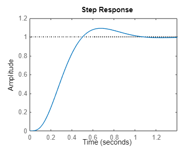
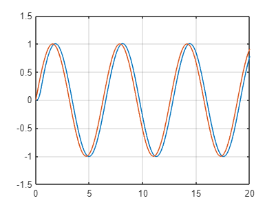

<table border="1">
 <tr>
    <td><b style="font-size:30px">MATLAB LIVE SCRIPT</b></td>
    <td><b style="font-size:30px">LIVE RESULTS</b></td>
 </tr>
 <tr>
    <td>

**System Definition**

```Matlab
clc
clear
syms x1 x2 x3 x4 x5 x6 x7 x8 u_x u_y;

% System's Type
MIMO = 1;

% constants
m = 0.11;
Ib = 1.76e-5;
rb = 0.02;

b = m/ (m + Ib/ rb^2)
g = 9.81;

% Non-linear system's state-space
X = [x1 x2 x3 x4 x5 x6 x7 x8];
U = [u_x u_y];
f =[ x2;
     b*(x1*x4*x4+x4*x5*x8-g*sin(x3));
     x4;
     u_x;
     x6;
     b*(x5*x8*x8+x1*x4*x8-g*sin(x7));
     x8;
     u_y;
    ];

% Linearized system's state-space
As = jacobian(f, X);
A = subs(As, [X,U], [0 0 0 0 0 0 0 0 0 0]);
A = double(A)
n = length(A);

Bs = jacobian(f, U);
B = subs(Bs, [X,U], [0 0 0 0 0 0 0 0 0 0]);
B = double(B)
[~,p] = size(B);

C = [1 0 0 0 0 0 0 0; 0 0 0 0 1 0 0 0]
[l,~] = size(C);

D = zeros(l,p)

sys = ss(A,B,C,D);
G=tf(sys)
Input_1_to_ouput1=G(1,2)
Input_2_to_ouput2=G(2,1)
```

<hr>

```Matlab
% Input_1_to_ouput1 is equal to Input_2_to_ouput2 so can
% split A into two SISO system
A_X=[0 1 0 0
    0 0 -g*b 0
    0 0 0 1
    0 0 0 0]
B_X=[0; 0; 0 ;1]
C_X=[1 0 0 0]
D_X=[0]
```

<hr>

```Matlab
rank(obsv(A,C)) % == 8 
rank(ctrb(A,B)) % == 8
%% so our system is minimal
```

<hr>

```Matlab
desired_OS = 10;
Ts=1;
zita = 0.59;
w = 6.77;
sd_1=-zita*w + w * sqrt(zita^2-1)
sd_2=-zita*w - w * sqrt(zita^2-1)
sd_3=-20
sd_4=-30
```

<hr>

```Matlab
K_X=place(A_X,B_X,[sd_1 sd_2 sd_3 sd_4])
K = [K_X 0 0 0 0;0 0 0 0 K_X]
```

<hr>

```Matlab
controlled_tf=tf(ss(A_X-B_X*K_X,B_X,C_X,D_X))
```

<hr>

```Matlab
static_compensator=evalfr(controlled_tf,0)^(-1);

step(static_compensator*controlled_tf);

t = linspace(0, 20, 1000);                         % Time Vector
u = sin(t);                                     % Forcing Function
y = lsim(static_compensator*controlled_tf, u, t);                                % Calculate System Response
figure(1)
plot(t, y, t, u)
grid
```

<hr>

```Matlab
A_bar = [A_X zeros(4,1); -C_X zeros(1,1)];
B_bar = [B_X;  zeros(1,1)];
k_new = place(A_bar,B_bar,[sd_1,sd_2,sd_3,sd_4,-40])
k_d = [k_new(1:4) 0 0 0 0; 0 0 0 0 k_new(1:4)]
dynamic_pre_comp = [-k_new(:,5:end) 0; 0 -k_new(:,5:end)]
```
</td><td>

**b** *(1x1)*:

```
0.7143
```
**A** *(8x8) double*:

```
         0    1.0000         0         0         0         0         0         0
         0         0   -7.0071         0         0         0         0         0
         0         0         0    1.0000         0         0         0         0
         0         0         0         0         0         0         0         0
         0         0         0         0         0    1.0000         0         0
         0         0         0         0         0         0   -7.0071         0
         0         0         0         0         0         0         0    1.0000
         0         0         0         0         0         0         0         0

```
**B** *(8x2) double*:

```
     0     0
     0     0
     0     0
     1     0
     0     0
     0     0
     0     0
     0     1

```
**C** *(2x8) double*:

```
     1     0     0     0     0     0     0     0
     0     0     0     0     1     0     0     0

```
**D** *(2x2) double*:

```
     0     0
     0     0

```

```
G =
 
  From input 1 to output...
       -7.007
   1:  ------
        s^4
 
   2:  0
 
  From input 2 to output...
   1:  0
 
       -7.007
   2:  ------
        s^4
 
Continuous-time transfer function.


```

```
Input_1_to_ouput1 =
 
  0
 
Static gain.


```

```
Input_2_to_ouput2 =
 
  0
 
Static gain.


```
**A_X** *(4x4) double*:

```
         0    1.0000         0         0
         0         0   -7.0071         0
         0         0         0    1.0000
         0         0         0         0

```
**B_X** *(4x1) double*:

```
     0
     0
     0
     1

```
**C_X** *(1x4) double*:

```
     1     0     0     0

```

**D_X** *(1x1)*:

```
0
```

**ans** *(1x1)*:

```
8
```

**ans** *(1x1)*:

```
8
```

**sd_1** *(1x1)*:

```
-3.9943 + 5.4661i
```

**sd_2** *(1x1)*:

```
-3.9943 - 5.4661i
```

**sd_3** *(1x1)*:

```
-20
```

**sd_4** *(1x1)*:

```
-30
```
**K_X** *(1x4) double*:

```
	1.0e+03 *

   -3.9245   -1.0111    1.0453    0.0580

```
**K** *(2x8) double*:

```
	1.0e+03 *

   -3.9245   -1.0111    1.0453    0.0580         0         0         0         0
         0         0         0         0   -3.9245   -1.0111    1.0453    0.0580

```

```
controlled_tf =
 
                     -7.007
  ---------------------------------------------
  s^4 + 57.99 s^3 + 1045 s^2 + 7085 s + 2.75e04
 
Continuous-time transfer function.


```






**k_new** *(1x5) double*:

```
	1.0e+05 *

   -0.4437   -0.0698    0.0336    0.0010    1.5698

```
**k_d** *(2x8) double*:

```
	1.0e+04 *

   -4.4368   -0.6978    0.3365    0.0098         0         0         0         0
         0         0         0         0   -4.4368   -0.6978    0.3365    0.0098

```
**dynamic_pre_comp** *(2x2) double*:

```
	1.0e+05 *

   -1.5698         0
         0   -1.5698

```
**k_new** *(1x5) double*:

```
	1.0e+05 *

   -0.4437   -0.0698    0.0336    0.0010    1.5698

```
</td></tr></table>
